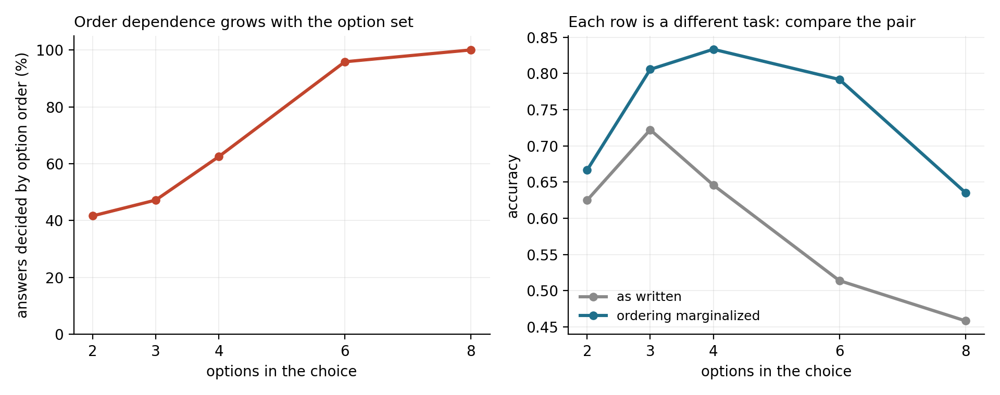

<div align="center">

# Jev-Evolve: is your agent deciding, or reading the option order?

**The same schema, the same model and the same 96 items scored 0.188 or 0.542 depending on what order the options were listed in. Find out what your typed decision is actually deciding on, remove it, and stop believing searches that never cleared their own noise floor.**

[](https://pypi.org/project/jev-evolve/)
[](https://pypi.org/project/jev-evolve/)
[](LICENSE)
[](https://github.com/novaleolin/jev-evolve/actions)

**[Quickstart](#quickstart) · [The measurement](#the-measurement) · [Why jev](#why-typed-decisions-and-why-a-fast-one) · [How it works](#how-it-works) · [API](#api) · [FAQ](#faq) · [简体中文](README.zh-CN.md)**

</div>

---

## What is Jev-Evolve?

An agent framework where every branch is a typed question: pick one of these
options, yes or no, score this. Not generated text that something downstream
parses.

It exists because of what fell out of building it. We took an eight-option
support-intent schema with careful hand-written rules and evolved its text
for 14 generations and 43 candidates. It improved nothing, twice. The reason
was not the search:

```
  answers that changed across 8 option orderings   96/96  (100%)
    of which noise alone                            0/96  (0%)
  accuracy by ordering            0.188 to 0.542   spread 0.354
```

The schema was not measuring its criteria. It was measuring where each option
happened to sit in the list. Every text mutation had been fighting that.

So the library does three things, in this order:

| | |
|---|---|
| **1. Measure** | `permutation_sensitivity` runs k orderings against k fixed-order controls, so option order is not blamed for backend noise |
| **2. Fix** | `Marginalized` averages the ordering away. **+15.6 points held-out**, against +0.0 from every text operator on the same schema |
| **3. Verify** | `evolve` reports what a search of the same size scores when nothing improved, and decides on held-out data |

## Quickstart

```bash
pip install jev-evolve
python examples/order_check.py     # 20 seconds, no API key, no downloads
```

Check before you tune. It is the cheapest thing in the library and it decides
whether anything else you do can mean something. The example runs it on two
schemas, one that fails and one that passes, because a check that always
fires is not a check.

```python
from jev_evolve import permutation_sensitivity, Marginalized, run_policy

print(permutation_sensitivity(policy, backend, tasks, score, k=8).report())
```

```
  option orderings tried   8   (plus 8 controls with the order held fixed)
  answers that changed     96/96   (100.0%)
    of which noise alone   0/96   (0.0%)
    attributable to order  100.0%
  accuracy by ordering     0.188 to 0.542   spread 0.354
    control spread         0.000

  ORDER-DEPENDENT: this schema is partly measuring option
  position, so tuning its text will mostly fit noise.
  Wrap the backend in Marginalized(backend, k) and re-check.
```

Then fix it, which is one wrapper:

```python
run_policy(policy, Marginalized(backend, k=8), tasks, score)
```

## The measurement

Qwen2.5-0.5B, 96 banking77 items over 8 confusable card intents, one written
rule per option. `python experiments/order_dependence.py --k 8`.

Eight orderings of the same eight options:

| ordering | accuracy |
| :--- | ---: |
| 0 (as written) | 0.458 |
| 1 | 0.302 |
| 2 | 0.438 |
| 3 | **0.542** |
| 4 | **0.188** |
| 5 | 0.417 |
| 6 | 0.385 |
| 7 | 0.438 |

Which number your schema ships with depends on the order you happened to
type the options in.

### The control that the claim depends on

Averaging k calls could help simply because it is an ensemble, which would
have nothing to do with option order, with typed decisions, or with this
library. So the same k calls are also run with the ordering left alone:

| split | as written | k calls, order fixed | k calls, order permuted |
| :--- | ---: | ---: | ---: |
| train | 0.458 | 0.458 | **0.635** (+0.177) |
| held-out | 0.448 | 0.448 | **0.604** (+0.156) |

The fixed-order column equals the as-written column to three decimals. The
backend is deterministic, so ensembling contributes exactly nothing, and the
entire gain is the permuting.

### Searching for a good order is not the same as removing it

Both halves of the library meet on this table. Picking the best of the eight
orderings on the training split is a search, so the selection floor applies
to it. Marginalizing selects nothing, so it does not.

| | train gain | floor | held-out gain |
| :--- | ---: | ---: | ---: |
| pick the best of 8 orderings | +0.083 | **+0.073** | +0.115 |
| marginalize the ordering away | n/a | none applies | **+0.156** |

The search's apparent train gain of +0.083 sits +0.010 above the +0.073 that
eight candidates on 96 items score with no real differences at all. Almost
all of it was the selection. It still transfers, to +0.115 on held-out, and
it is still worse than removing the dependence, which reaches +0.156 without
selecting anything and beats the luckiest ordering in the set.

That is the argument for fixing a bias rather than tuning around it, on one
schema, with numbers.

### Order dependence grows with the option set

Practitioners report that a typed decision model's label boundaries get
unstable as the candidate set grows while small candidate sets stay
reliable. Much of that instability is the ordering, and it is fixable.
`python experiments/option_count.py`:

| options | n | decided by order | as written | marginalized k=8 |
| ---: | ---: | ---: | ---: | ---: |
| 2 | 24 | 41.7% | 0.625 | 0.667 (+0.042) |
| 3 | 36 | 47.2% | 0.722 | 0.806 (+0.083) |
| 4 | 48 | 62.5% | 0.646 | **0.833 (+0.188)** |
| 6 | 72 | 95.8% | 0.514 | **0.792 (+0.278)** |
| 8 | 96 | 100.0% | 0.458 | 0.635 (+0.177) |



Read the table down the "decided by order" column and across each row. Do not
read the accuracy columns down: every row is a different task over a
different label subset, with a different chance level and a different `n`, so
accuracies are not comparable between rows. The 2-option row rests on 24
items and its flip rate is roughly estimated.

What the numbers support is narrow and useful: the share of answers decided
by option order rises monotonically with the option set, and the value of
marginalizing rises with it.

### Irrelevant state moves the answer too

Option order is one invariance. Here is a second, and the same control
applies. `state_sensitivity` adds fields that cannot bear on the decision,
drawn from things that read like real business metadata (`session_id`,
`ab_bucket`, `queue_depth`, `agent_shift`) rather than obvious filler,
because a model that shrugs off obvious filler can still be moved by
something that looks like it belongs.

Three such fields, on the same 8-option schema:

```
  answers that changed     30/96   (31.2%)
    of which noise alone   0/96   (0.0%)
    attributable to padding 31.2%
  accuracy, clean          0.458
  accuracy, padded         0.391   (-0.068)

  STATE-SENSITIVE
```

Three irrelevant fields moved 31% of the answers and cost 6.8 accuracy
points, with the control at zero. That is the practitioner complaint about
long contexts, reproduced at three extra fields rather than a long prompt,
and it is why `mutate_state_fields` searches over what each decision point
can see instead of leaving it to a design review.

### A third invariance, this one about content

The two checks above are about formatting. A practitioner report pointed at
something else: these models get pulled toward the most vivid event in the
input and miss the responsible party, the root cause or the precondition.
That is a claim about content, so it needs a different probe, and it needs a
control that separates capture from ordinary degradation.

`salience_sensitivity` builds a contrast set. Every item is a real banking77
utterance of intent A. Its twin prepends a real utterance of a different
intent B, quoted and marked as already resolved, with the gold label kept at
A: what happened last month and was settled does not change where today's
request is routed. Then it asks one question. Of the answers the injection
broke, how many landed on B?

Extra text can simply degrade a decision, and then the new errors spread
across the wrong labels. Capture concentrates them on B. The baseline is not
the theoretical 1/(m-1) but the model's own rate for the B label among its
unperturbed errors, because a model with a favourite label beats the
theoretical level on every label and would look captured.

Same 8-option schema, ordering marginalized first so the effect is not read
off order noise, 192 pairs (`python experiments/salience_probe.py`):

```
  accuracy, clean          0.620
  accuracy, distractor in  0.495   (-0.125)
  answers it broke         29   (and 5 it happened to fix)
    landed on the distractor  19   (65.5%)
    this model's own rate     15.1%   (73 clean errors)
    -> 4.3x   p=1.04e-09

  CAPTURED
```

The matched control sits at 15.1%, next to the theoretical 14.3%, so the
model has no special appetite for the labels that were drawn as distractors.
The concentration is the injection.

### And the two obvious fixes both make it worse

A finding like that invites two responses, and both were tested, cheap one
first (`python experiments/decomposition.py`):

| arm | accuracy | captured | vs baseline | decisions/item |
| :--- | ---: | ---: | :--- | ---: |
| A baseline, as written | **0.495** | 56.7% | | 1 |
| B one instruction: ignore resolved matters | 0.438 | 48.1% | 5 fixed / 16 broken, **p=0.027 worse** | 1 |
| C a separate typed gate, then a routed intent question | 0.422 | 44.1% | 7 fixed / 21 broken, **p=0.013 worse** | 2 |

The gate in arm C was right on 160 of 192 items, so this is not a broken
gate. Capture fell monotonically across the arms, so both interventions hit
what they aimed at. They cost more than they saved, and the state check above
says why: on this model, adding text to the context is itself expensive.
The fix for a content bias is more instruction, and more instruction is the
thing this model handles badly. That tension is real, it is measured, and
this library does not paper over it by shipping arm C as a feature.

```python
from jev_evolve import salience_sensitivity, quote_prior

s = salience_sensitivity(policy, backend, tasks,
                         quote_prior("text", examples_by_label), score)
print(s.report())      # .share .matched_control .ratio .p_value .captured
```

`inject(state, label, rng) -> (new_state, distractor_label)` is yours and
must preserve the gold label; `quote_prior` is the ready-made one for text
classification.

## Why typed decisions, and why a fast one

### The search space exists because the decisions are typed

An agent that decides by generating text gives a tuning loop one prompt and
one scalar per episode. An agent whose branches are typed questions gives it
a structure, and the structure is most of what there is to work with.

| what a loop can see or change | generating agent | typed-decision agent |
| :--- | :---: | :---: |
| instruction wording | yes | yes |
| the text describing each option | no, options are not a declared set | yes |
| **the order the options are presented in** | not separable from the prompt | yes |
| which decision runs first | no, it is one blob | yes |
| what each decision is allowed to see | no, it is one context | yes |
| when to abstain instead of answering | no calibrated probability | yes |
| which option to sharpen, against which rival | no probability vector | yes |
| which decision point lost the episode | one scalar outcome | yes |

The third row is the one this project was built on the wrong side of.
Permuting the options of a declared option set is a well-defined operation.
Permuting "the options" inside a free-text prompt is not.

### And the fix costs k decisions per answer

Marginalizing over orderings is not a new idea. What is new is being able to
afford it. Measured on the same connection, same items, same option set, same
criteria text, 160 items over 8 confusable intents:

| model | accuracy | p50 | p90 |
| :--- | ---: | ---: | ---: |
| typesafe/jev-1.13 | 0.856 | **450 ms** | **536 ms** |
| mistralai/mistral-nemo | **0.900** | 656 ms | 1206 ms |
| qwen/qwen3.7-flash | 0.881 | 764 ms | 917 ms |
| openai/gpt-5-nano | 0.881 | 703 ms | 907 ms |
| ibm-granite/granite-4.0-h-micro | 0.786 | 568 ms | 1064 ms |

Read it honestly: out of the box the decision model was the fastest with by
far the tightest tail, and **4.4 points less accurate** than the best cheap
generative model.

That is the whole argument, and it is not about speed for its own sake. At
450 ms with a p90 of 536, `Marginalized(backend, k=8)` is a decision that
takes a few seconds. At 3 seconds a call with a p90 over a second wider, the
same fix is half a minute per decision and nobody ships it. A known, correct,
expensive correction becomes practical, and on the local model it was worth
+15.6 points on held-out data, which is more than three times the gap the
decision model started with.

## How it works

Five pieces, each usable on its own.

**Policy.** The decision points, as data: instruction text, per-option
criteria, the order the options are listed in, which state fields each point
can see, and the confidence below which it abstains. All searchable.

```python
from jev_evolve import Policy, choice, noul

policy = Policy({
    "in_scope": noul("Is this about a bank account?", threshold=0.6),
    "intent":   choice("Which intent?", {"lost_card": "...", "top_up": "..."},
                       threshold=0.3, state_fields=["text", "channel"]),
}, order=["in_scope", "intent"])
```

**Invariance.** The check and the fix. Run it first.

```python
from jev_evolve import permutation_sensitivity, Marginalized

s = permutation_sensitivity(policy, backend, tasks, score, k=8)
if not s.sound:
    backend = Marginalized(backend, k=8)
```

`Sensitivity` carries `.flip_rate`, `.noise_rate` from the control, and
`.excess_flip_rate`, which is the part attributable to order. The verdict
rests on the excess, and on the flip rate rather than the spread, because
max-minus-min over k runs grows with k on its own and is badly resolved at
any k worth paying for.

**Agent.** A loop over the points. `act(state, answer)` applies each answer
and is where your tools live. Return `{jev_evolve.STOP: True}` to finish.

```python
def act(state, answer):
    if answer.name == "in_scope" and not answer:
        return {jev_evolve.STOP: True, "outcome": "handoff"}
    return {answer.name: answer.choice}

episode = Agent(policy, backend, act=act).run("t1", {"text": "lost my card"})
```

`answer` is falsy when the point abstained or answered no. `answer.margin`
is the gap to the runner-up.

**Trace.** Every decision, its probabilities and its latency, as JSONL.

```python
jev_evolve.confusions(trace)       # (point, picked, should have been) -> count
jev_evolve.point_accuracy(trace)   # which point owns the loss
jev_evolve.overconfident(trace)    # wrong and sure: thresholds cannot catch these
jev_evolve.cost(trace)             # decisions and seconds per episode
```

**Evolve.** Generations of mutants, scored, best kept, and an honest report.

```python
from jev_evolve.mutate import default_operators

ops = default_operators(available_fields=["text", "channel"],
                        examples_by_label=INTENTS, trace=trace)
res = evolve(policy, backend, train, score, ops, heldout=held)
print(res.report())
res.best.save("policy.json")
```

A loop that keeps the best of many candidates reports a gain even when
nothing improved. `python examples/null_loop.py` runs this loop against a
backend that answers at random and ignores the policy, where the true gain
is exactly zero:

```
   5 generations  apparent gain +0.017   floor +0.064   NOT CONFIRMED
  20 generations  apparent gain +0.050   floor +0.086   NOT CONFIRMED
  60 generations  apparent gain +0.058   floor +0.101   NOT CONFIRMED
```


The reported gain grows with the number of generations on an agent that is
not improving. Every self-improving loop that selects on an eval score has
this; most do not report it. The arithmetic is
[evalfloor](https://github.com/novaleolin/evalfloor), a dependency rather
than a copy.

## Mutations

Six edit the policy blind. Two read the agent's own trace.

| operator | what it changes | needs |
| :--- | :--- | :--- |
| `mutate_option_order` | how the options are ordered | nothing |
| `mutate_threshold_from_trace` | abstention, on a grid read off the backend's own confidences | a trace |
| `mutate_order` | which point runs first, and so what later points see | nothing |
| `mutate_state_fields` | what one point is allowed to see | field names |
| `mutate_criteria_from_examples` | describes an option by real inputs | labelled data |
| `mutate_criteria_from_errors` | describes an option by inputs it **missed** | a trace |
| `mutate_from_confusions` | rewrites the option most often picked by mistake | a trace, a rewriter |
| `mutate_instructions` | rewrites a point's instruction text | a rewriter |

Use `mutate_threshold_from_trace` rather than the fixed-grid
`mutate_threshold`. On the 8-option task above, the fixed grid's values at or
below 0.2 were all the same no-op, and those at or above 0.5 abstained on
four decisions in five: two of eleven grid points did anything at all, and a
third of the candidate slots in a 15-generation run went to values that could
not have helped.

A rewriter is any `(text, slot, rng) -> text`. The `rng` is part of the
contract: a rewriter reaching for the global `random` makes a run
unreproducible, and a tool whose job is telling you how much of a gain is
real cannot give a different answer each time you ask.

## Backends

| backend | what it is | cost |
| :--- | :--- | :--- |
| `RuleBackend` | a Python function. Tests, baselines, hybrid policies | free |
| `OverlapBackend` | `jev_evolve.demo`, scores by word overlap. Examples and CI | free |
| `LocalBackend` | option logits from any causal LM, one prefill, no generation | local GPU |
| `JevBackend` | a hosted typed-decision endpoint | per call |
| `Marginalized` | wraps any of the above, k orderings averaged | k times the inner |

`LocalBackend` needs `pip install "jev-evolve[local]"`. Everything else works
with no extra dependency, and `import jev_evolve` pulls in no model library.

`JevBackend` defaults to the OpenRouter decisions API and takes `endpoint=`
for anything with the same `{model, state, questions}` shape. Nothing else in
the package knows which vendor is behind it.

Hosted providers generally forbid using output to train or build a competing
model, and a generational loop is thousands of decisions. Evolve against
something you own, then validate the winner:

```python
from jev_evolve import JevBackend, validate_transfer

t = validate_transfer(policy, res.best, JevBackend(), heldout, score)
print(t.report())    # costs exactly 2 * len(heldout) calls
```

`validate_transfer` reports no floor and none applies: two fixed policies
scored on the same items select nothing. Running it over several candidates
and keeping the best would reintroduce selection, and the floor with it.

## API

```python
from jev_evolve import Policy, Point, choice, noul       # the policy
from jev_evolve import permutation_sensitivity, state_sensitivity, salience_sensitivity, quote_prior
from jev_evolve import Marginalized, Sensitivity, StateSensitivity
from jev_evolve import Agent, Answer, STOP               # the loop
from jev_evolve import Trace, Episode, Decision          # the record
from jev_evolve import evolve, run_policy, Result        # the search
from jev_evolve import validate_transfer, Transfer       # local -> hosted
from jev_evolve import confusions, point_accuracy, overconfident, cost

permutation_sensitivity(policy, backend, tasks, score, k=4)
# -> Sensitivity: .flip_rate .noise_rate .excess_flip_rate .sound .report()

state_sensitivity(policy, backend, tasks, score, k=4, fields=3)
# -> StateSensitivity: .excess_flip_rate .cost .sound .report()

salience_sensitivity(policy, backend, tasks, inject, score)
# -> SalienceSensitivity: .share .matched_control .ratio .p_value .captured

evolve(policy, backend, tasks, score, operators,
       generations=20, candidates=4, heldout=None, act=None, seed=0)
# -> Result: .best .gain .floor .heldout .credible .verdict .report()

validate_transfer(base, evolved, backend, tasks, score)
# -> Transfer: .gain .paired .transferred .calls .p50_s .p90_s .report()
```

A task is `(id, state, label)` or `{"id":..., "state":..., "label":...}`.
`score(episode) -> float` is yours; 0/1 keeps the floor arithmetic exact.

## Limits

`permutation_sensitivity` covers option order, `state_sensitivity` covers
irrelevant fields and `salience_sensitivity` covers capture by a vivid
distractor. State field order and option naming are still untested, and a
schema that passes all three may still be measuring one of those. The
salience probe's gold labels are preserved by construction, not by human
annotation, and its demo-backend result is mechanically trivial (a
bag-of-words scorer fed a whole sentence of label B); the evidence is the
Qwen2.5-0.5B run, which is not a bag of words.

The reported floor assumes candidates are evaluated independently on a 0/1
metric. Candidates in an evolutionary loop are correlated by descent, which
makes the true floor higher, so the printed number is a lower bound.

Attribution needs to know which decision point should have answered what.
With one choice point, `default_gold` handles it. With more, pass your own
`gold(episode) -> {point: answer}`. It refuses to guess, because a guessed
attribution aims every later mutation at the wrong decision.

The measurements above are one model on one 8-option task. The mechanism is
general and well documented elsewhere; the magnitude is not a constant, which
is why the check ships as a function you run on your own schema instead of a
number you take from this README.

## FAQ

**My agent already works. What do I get?**
Run `permutation_sensitivity` on one recorded set. It costs `2 * k * n`
decisions and tells you whether your schema is measuring its criteria or its
formatting. That is worth the afternoon before anything else here.

**Isn't option-order bias a known problem?**
Yes, and that is the point. It is known, the fix is known, and it is skipped
because it costs k times as much. What this library adds is measuring it
against a control, fixing it in one wrapper, and making the cost affordable
by putting the decision on a model built for decisions.

**Why not just search for the best ordering?**
Measured above: picking the best of eight gave +0.115 on held-out, while
almost all of its training gain was selection noise. Marginalizing gave
+0.156 and selected nothing.

**Do I need a Jev or System One model?**
No, and the name is still right. What the library needs is that decisions be
*typed*, which is what the search space is made of. A jev-class model is the
cheapest, lowest-latency way to serve typed decisions, which is what makes
`Marginalized` and a thousand-decision loop affordable. `LocalBackend` and
`RuleBackend` serve typed decisions too.

**How is this different from DSPy or a prompt optimiser?**
Those search over prompt text and few-shot examples, which is one row of the
table above. The rest exist only because a decision is a declared object with
named options and calibrated probabilities. And a run here ends with a
verdict rather than a best score.

**Why is my run UNDERPOWERED?**
An exact sign test over `d` disagreements cannot return a p-value below
2^(1-d), so five or fewer never reach 0.05. Your held-out split is too small
to settle it, which is not the same as a negative result.

MIT.
