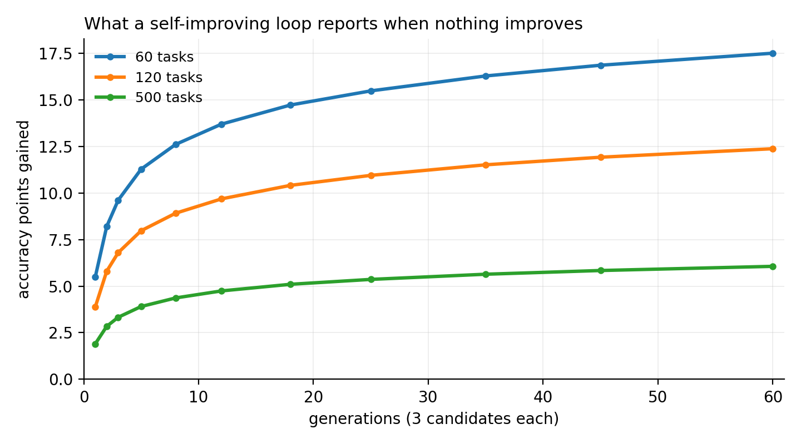

<div align="center">

# Jev-Evolve：会自我进化、也知道哪些是噪声的 Agent

**用类型化决策代替生成文本；策略从 agent 自己的错误里进化；并且告诉你这次提升有多少只是运气。**

[](https://pypi.org/project/jev-evolve/)
[](https://pypi.org/project/jev-evolve/)
[](LICENSE)
[](https://github.com/novaleolin/jev-evolve/actions)

**[快速开始](#快速开始) · [空转实验](#大家都跳过的那一步) · [工作方式](#工作方式) · [API](#api) · [常见问题](#常见问题) · [English](README.md)**

</div>

---

## Jev-Evolve 是什么

一个 agent 框架，agent 走的每一个分支都是一个类型化问题：在这些选项里选一个、是或否、给一个分数。
不是先生成一段文本，再由下游去解析。

这带来一个值得整个库存在的结果。agent 的策略变成了一个数据结构，循环可以对它做变异；
每个决策都带校准过的概率，循环因此能看清是哪个决策点输掉了哪条样本。agent 由自己的轨迹改进自己。

另外，一个"保留最优候选"的循环，即使什么都没改进也会报出提升，所以每次运行都会打印：
一个同等规模的循环，在一个根本没有变好的 agent 上，能报出多少提升。

| | |
|---|---|
| **类型化决策** | `choice`、`noul`、`score`。可接托管决策端点、本地模型，或一个普通 Python 函数 |
| **从轨迹进化** | 变异瞄准 agent 真正混淆的那一对选项，而不是随机改写 |
| **报告自身噪声** | `examples/null_loop.py` 里的空转循环跑 60 代报出 +0.058，而真实提升是 0 |
| **可离线运行** | 快速开始不需要 API key、不下载模型、不联网 |

## 快速开始

```bash
pip install jev-evolve
python examples/quickstart.py     # 20 秒，无需 API key
```

一个工单分流 agent，只有一个决策点，描述方式就是所有人一开始的写法：每个选项用它自己的名字当描述。

```python
from jev_evolve import Policy, choice, evolve, run_policy
from jev_evolve.demo import INTENTS, OverlapBackend, tickets
from jev_evolve.mutate import mutate_criteria_from_errors, mutate_threshold

train, held = tickets(120, seed=1), tickets(120, seed=2)
policy = Policy({"intent": choice(
    "这条工单属于哪个意图？",
    {k: k.replace("_", " ") for k in INTENTS})})

backend = OverlapBackend(seed=7)
score = lambda ep: float(ep.decisions[0].choice == ep.label)

# 先跑一遍，让变异有真实的错误可以瞄准。
trace = run_policy(policy, backend, train, score)

res = evolve(policy, backend, train, score,
             operators=[mutate_criteria_from_errors(trace), mutate_threshold()],
             generations=12, candidates=3, heldout=held, seed=3)
print(res.report())
```

```
  generations            13
  candidates scored      37
  baseline (train)       0.475
  winner   (train)       0.742   apparent gain +0.267
  selection floor        +0.097   <- the gain is above the floor
  baseline (held-out)    0.467
  winner   (held-out)    0.633   real gain +0.167
  held-out paired        30 fixed / 10 broken   p=0.0022

  verdict: CREDIBLE
```

被打分的候选是 37 个，不是最后保留下来的 4 个。下限按 37 个算，因为循环一共有 37 次撞运气的机会。

## 大家都跳过的那一步

把同一个循环跑在一个完全随机、根本不读策略的后端上。任何变异都帮不了它，真实提升恒为 0。

```bash
python examples/null_loop.py
```

```
   5 generations  apparent gain +0.017   floor +0.064   verdict NOT CONFIRMED
  20 generations  apparent gain +0.050   floor +0.086   verdict NOT CONFIRMED
  60 generations  apparent gain +0.058   floor +0.101   verdict NOT CONFIRMED
```



在一个完全没有变好的 agent 上，报出的提升随代数增长。这不是本循环的 bug，
而是"在多个带噪声的测量里取最大值"必然的结果，适用于每一个按评测分数做选择的自进化 agent。

Jev-Evolve 用两种方式处理它：打印下限，让你看到这个效应在自己场景下有多大；
以及把结论交给搜索从未碰过的 held-out 切分，用配对符号检验判定，
所以一次运行被判为 `CREDIBLE` 时，依据一定不是选择能制造出来的。

这部分算术来自 [evalfloor](https://github.com/novaleolin/evalfloor)，是依赖而不是拷贝，
所以只有一份实现，不会两份各自漂移。

## 工作方式

四个部件，每个都能单独用。

**Policy（策略）。** 把决策点写成数据：指令文本、每个选项的描述、每个决策点能看到哪些 state 字段、
以及低于多少置信度就弃权。四者都可搜索，其中三个是 prompt 优化器看不见的。

```python
from jev_evolve import Policy, choice, noul

policy = Policy({
    "in_scope": noul("这是银行账户相关的问题吗？", threshold=0.6),
    "intent":   choice("哪个意图？", {"lost_card": "...", "top_up": "..."},
                       threshold=0.3, state_fields=["text", "channel"]),
}, order=["in_scope", "intent"])
```

**Agent（循环）。** 按顺序跑这些决策点。`act(state, answer)` 应用每个回答，你的工具调用写在这里。
返回 `{jev_evolve.STOP: True}` 可以提前结束。

```python
from jev_evolve import Agent, RuleBackend

def act(state, answer):
    if answer.name == "in_scope" and not answer:
        return {jev_evolve.STOP: True, "outcome": "handoff"}
    return {answer.name: answer.choice}

episode = Agent(policy, backend, act=act).run("t1", {"text": "卡丢了"})
```

决策点弃权或回答"否"时 `answer` 为假值，所以 `if not answer` 两种情况都覆盖了。
`answer.margin` 是与第二名的差距，按它排序错误最有用。

**Trace（轨迹）。** 每个决策、它的概率分布和耗时，存成 JSONL。自带四个读法：

```python
jev_evolve.confusions(trace)       # (决策点, 选了什么, 本该选什么) -> 次数
jev_evolve.point_accuracy(trace)   # 哪个决策点吃掉了大部分损失
jev_evolve.overconfident(trace)    # 又错又自信，阈值救不了的那些
jev_evolve.cost(trace)             # 每条样本的决策数与秒数
```

**Evolve（进化）。** 一代代地生成变异体、打分、保留更好的。

```python
from jev_evolve.mutate import default_operators

ops = default_operators(available_fields=["text", "channel", "tier"],
                        examples_by_label=INTENTS, trace=trace)
res = evolve(policy, backend, train, score, ops, heldout=held)
res.best.save("policy.json")
```

## 变异算子

五个盲改策略，两个读 agent 自己的轨迹，后者正是轨迹存在的理由。

| 算子 | 改什么 | 需要 |
| :--- | :--- | :--- |
| `mutate_threshold` | 什么时候弃权而不是硬猜 | 无 |
| `mutate_order` | 哪个决策点先跑，也就改变了后面的点能看到什么 | 无 |
| `mutate_state_fields` | 某个决策点允许看到哪些字段 | 字段名 |
| `mutate_criteria_from_examples` | 用真实输入描述一个选项 | 带标注的数据 |
| `mutate_criteria_from_errors` | 用**漏掉的**输入描述一个选项 | 一份轨迹 |
| `mutate_from_confusions` | 重写最常被误选的那个选项 | 轨迹 + 改写器 |
| `mutate_instructions` | 重写决策点的指令文本 | 改写器 |

改写器是任意 `(text, slot, rng) -> text`。用 LLM 最直接，模板或一份手写列表也行。
`rng` 是契约的一部分：改写器如果去拿全局 `random`，整个运行就不可复现，
而一个专门告诉你"这次提升有多少是真的"的工具，不能每次问都给不同答案。

前四个完全不需要 LLM，所以跑一代是零成本的，永远不存在"因为预算所以跳过校验"。

## 后端

| 后端 | 是什么 | 成本 |
| :--- | :--- | :--- |
| `RuleBackend` | 一个 Python 函数。测试、基线、混合策略 | 免费 |
| `OverlapBackend` | `jev_evolve.demo` 里的词重叠打分器。示例与 CI | 免费 |
| `LocalBackend` | 任意 causal LM 的选项 logits，一次 prefill，不生成 | 本地算力 |
| `JevBackend` | 托管的类型化决策端点 | 按调用计费 |

`LocalBackend` 需要 `pip install "jev-evolve[local]"`。其余部分不需要任何额外依赖，
`import jev_evolve` 不会拉进任何模型库。

`JevBackend` 默认指向 OpenRouter 的 decisions API，传 `endpoint=` 可换成任何
同样收 `{model, state, questions}` 的服务。包里其它地方都不知道背后是哪一家。

关于在哪里跑循环：托管厂商通常禁止用其输出去训练或构建竞品模型。
把策略在本地或规则后端上进化，只把最终胜者拿到托管端点上验证一次，既不越线，也便宜得多。

## API

```python
from jev_evolve import Policy, Point, choice, noul       # 策略
from jev_evolve import Agent, Answer, STOP               # 循环
from jev_evolve import Trace, Episode, Decision          # 记录
from jev_evolve import evolve, run_policy, Result        # 搜索
from jev_evolve import confusions, point_accuracy, overconfident, cost

evolve(policy, backend, tasks, score, operators,
       generations=20, candidates=4, heldout=None, act=None, seed=0)
# -> Result: .best .gain .floor .heldout .credible .verdict .report()
```

一条 task 是 `(id, state, label)` 或 `{"id":..., "state":..., "label":...}`。
`score(episode) -> float` 由你实现，0/1 能让下限的算术是精确的。

## 局限

选择下限假设候选之间独立、在 0/1 指标上各评测一次。进化循环里的候选因为有血缘关系而相关，
这让真实下限比报出的更高，所以打印的数是一个下界。低于它的提升也一定低于真实下限；
高于它的提升仍然需要 held-out 检验。

错误归因需要知道哪个决策点本该给出什么答案。策略里只有一个 choice 点时 `default_gold` 能自动处理；
多于一个就要自己传 `gold(episode) -> {point: answer}`。它拒绝猜，
因为猜错归因会让之后每一次变异都瞄准错误的决策点。

耗时是后端调用前后的墙上时间，包含网络时间。

## 常见问题

**和 DSPy 之类的 prompt 优化器有什么不同？**
那些搜索的是 prompt 文本和少样本示例。这里的单位是一个类型化决策，
所以搜索还覆盖选项描述、每个决策点的可见字段、置信度阈值和决策顺序。而且运行结束给的是判定，不是一个最高分。

**必须有 Jev 或 System One 模型吗？**
不必。`RuleBackend` 和 `OverlapBackend` 什么都不需要，`LocalBackend` 用读 logits 的方式跑任意 causal LM。
托管的类型化决策端点只是四个后端之一。

**我的 agent 已经能用了，装这个能得到什么？**
只要记录一次运行，`confusions()` 和 `point_accuracy()` 通常就能显示：损失大部分由某一个决策点贡献。
在做任何进化之前，这一条就值一个下午。

**为什么我的运行是 UNDERPOWERED？**
`d` 个分歧上的精确符号检验，p 值下界是 2^(1-d)，所以 5 个及以下永远到不了 0.05。
胜者可能确实更好，只是 held-out 切分太小，显示不出来。加数据。

**下限是不是说明我的提升是假的？**
它说明"这个规模的搜索白送你这么多"。判定来自 held-out 符号检验，不来自下限。
训练集增益低于下限的胜者仍可能可信，`Result.credible` 会这么说。

MIT。
